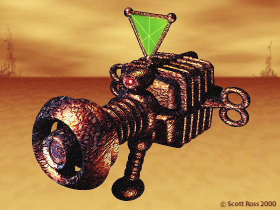

# Martian Heat Ray (Personal)
Primary infantry weapon of the Martians.

## Details
A hand(tentacle)-held box-like device with a focusing lens on one side and a series of controls on the other.  It was designed to be operated by 3 or more tentacles at once, making it difficult for a human to use.  It fires an intense beam of focused heat capable of starting fires and meting metal at several dozen meters.

## Appearances
- [Issue 001 -- Invasion (War of the Worlds Part 1)](/sessions/Issue-001.md)

<!--
Secrets
-->