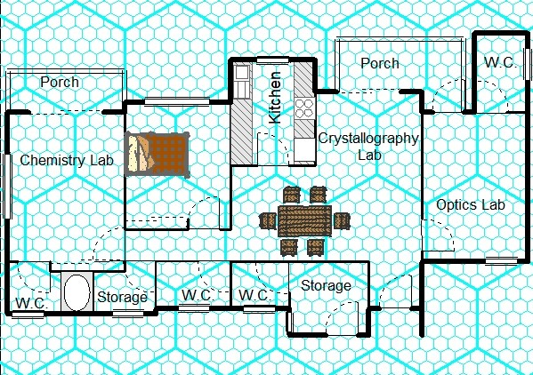

# Shard's Laboratory

Converted from the old [Antonova_Estate](locations/New_York_State/New_York_City/Staten_Island/Antonova_Estate.md) servant's quarters. From the outside, it looks like a pleasant little brick cottage. Inside, [Shard](player_characters/Shard.md) has several labs and a bit of living space for herself. The chemistry lab has been especially reinforced (at [Diamondback's](player_characters/Diamondback.md) insistence) to be able to better withstand potential explosions and to keep any noxious fluids or gasses from escaping.

## Headquarters Of
[Shard](player_characters/Shard.md)

## Residents
[Shard](player_characters/Shard.md)

## Visited By

## Other
[Character Sheet](https://legends-of-the-golden-age.github.io/LotGA/pdf/Shard_Lab.pdf)

## Appearances
- [Issue 004 -- A Lull in the Storm (War of the Worlds Part 4)](sessions/Issue-004.md)
