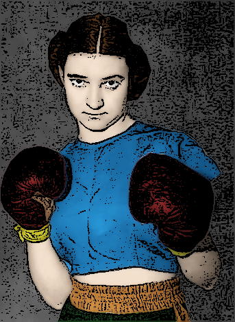

<!--
type: non-player-character
created-by:
-->

# Ka-Pow!

Tough as nails boxer plus a skilled mechanic and driver with minor metahuman talents.

## AKA:
Vika Mekenzie

## Appearance
Trait | Description
-- | --
Hair: | Brown
Eyes: | Brown
Height: | 5' 5"
Weight: | 135lbs
Gender: | female
Notes: |

## Background / Origin
Raised as part of the working class, Ka-Pow was her father's darling.  She spent as much time in his automotive shop as she did in any other pursuit.  Her tomboy attitude, unfortunately, resulted in much teasing and bullying from her classmates.  As she got older, her father's best friend -- a skilled if unlucky professional boxer, taught her how to defend herself.  She grew strong, stronger than anyone she knew; stronger, even, than the professional fighters she practiced against.  Later, she would learn that her mother had been exposed to a strange meteorite while pregnant.  Unfortunately, it likely resulted in her mother's death during childbirth.  It may also be the source of her practically superhuman strength, speed and resilience.  Since her mentor was crippled by the Colletti Mob for refusing to take a dive, she has dedicated herself to wiping out organized crime.

She earns her living as a mechanic and uses her fighting skills and toughness to protect her local neighborhood during her off-hours.

## Personality

## Powers
- Armored Jacket\*
- Very Tough\*
- Extremely Strong\*
- Highly Skilled Boxer\*
- Customized Motorcycle\*

 * Known to the general public

## Notes

### Allies
- [Amon-Ra](Amon-Ra.md)
- [Diamondback](Diamondback.md)
- [Double-Time](Double_Time.md)
- [Faceless](Faceless.md)
- [Professor Polar](Professor_Polar.md)
- [Shard](Shard.md)

### Associates
- Guardians of Freedom
- Thomas 'Thunderhead' Russ
- U.S. Military

### Birthplace
[New York City](/locations/New_York_State/New_York_City/New_York_City.md)

### Enemies
- Colletti Mob
- Martians
- Nazis

### Home
[New York City](/locations/New_York_State/New_York_City/New_York_City.md)

### Property
- [Customized Indian Chief](../items/Ka-Pow_Motorcycle.md) (motorcycle)
- Personal Garage/Workshop

### Memberships
- [Vanguard](/organizations/Vanguard.md) (part-time)

### Relations

### Rivals

### Visited

## Adventures
Issue 01 - Invasion (War of the Worlds Part 1)

## Character Sheet
[Character Sheet](https://legends-of-the-golden-age.github.io/LotGA/pdf/Ka-Pow.pdf)

<!-- GM Notes
[Hero Designer File](<>)
[pdf](<>)
-->