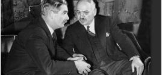

<!--
type: non-player-character
created-by:
-->

# Sir Mansel of Muddlescrombe

Assistant to the The British Ambassador to the United States, Sir Ronald Lindsay.  He has been in diplomatic service for nearly 15 years now, having served in France, Germany and Turkey before his posting to the United States.  While his superior mainly resides in Washington D.C., Sir Mansel stays in [New York City](locations/New_York_State/New_York_City/New_York_City.md) as it is a major hub of business, culture and politics in the U.S. 

## AKA:

## Appearance
Trait | Description
-- | --
Hair: | black and grey
Eyes: | brown
Height: | 5' 9"
Weight: | 190lbs
Gender: | male
Notes: |

## Background / Origin

## Personality

## Powers

 * Known to the general public

## Notes
Fluencies: French, German

### Allies
- [Tarraingteacht](npcs/Tarraingteacht.md)

### Associates

### Birthplace

### Enemies
- Nazis

### Home
- [New York City](locations/New_York_State/New_York_City/New_York_City.md)

### Property

### Memberships

### Relations

### Rivals

### Visited

## Adventures
Issue 01 - Invasion (War of the Worlds Part 1)

<!-- GM Notes
[Hero Designer File](<>)
[pdf](<>)
-->