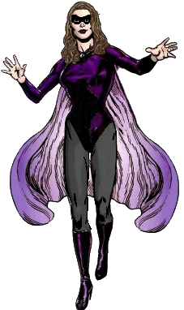

<!--
type: player-character
created-by:
-->
# Tarraingteacht

A British secret agents who gained magnetic powers while visiting the [Orkney Islands](https://en.wikipedia.org/wiki/Orkney).

- [AKA](#AKA)
- [Appearance](#Appearance)
- [Personality](#Personality)
- [Origin](#Origin)
- [Powers](#Powers)
- [Notes](#Notes)
- [Allies](#Allies)
- [Associates](../npcs/Lawrence_Alexander_Williams.md#Associates)
- [Birthplace](#Birthplace)
- [Enemies](#Enemies)
- [Home](#Home)
- [Property](#Property)
- [Memberships](#Memberships)
- [Relations](#Relations)
- [Rivals](#Rivals)
- [Visited](#Visited)
- [Adventures](#Adventures)
- [Character Sheet](#Character%20Sheet)

## AKA:
Aoife Stewart, Alice Stevens

## Appearance 
Trait | Description
-- | --
Hair: | Brown
Eyes: | Hazel
Height: | 5' 5"
Weight: | 139 lbs
Gender: | female
Born: |
Notes: |

## Personality

## Origin
Aoife grew up in and around London, England.  During university, she was recruited by the [British Special Operations Executive](organizations/British%20Government/British_SOE.md) (aka British Intelligence).  Word of her skill with a variety of exotic fighting styles had gotten around and they felt that her unassuming appearance and demeanor, coupled with her fighting skills, would make her an excellent clandestine body-guard for British VIPs.  A few years ago, she had accompanied her father on an archaeological dig in the Orkney Islands.  One island, in particular, had been perplexing researchers for years due to its strange magnetic properties.  Perhaps it was coincidence or perhaps it was fate that a sudden storm rose up while Aoife was walking alone on the isle.  While the storm did her no harm as she sheltered under a natural rock overhang, afterward she discovered that she had the ability to manipulate magnetic fields around her.  Recently, she has been assigned as an attaché to the British Ambassador in New York, but this is just her cover job.  Her real task is to keep an eye out for Nazi agents and sympathizers.  Britain wants to remain well-aware of how U.S. sympathies are leaning as tensions heat up in Europe and Asia.

## Powers
- Bullet-Resistant Costume
- Magnetic Control\* 
		- acting as a living radio
		- constructing metal barriers\*
		- deflecting metallic projectiles\*
		- hurling metal objects\* 
		- levitation\*
- Skilled martial artist

 * Known to the general public

## Notes
Fluent in Russian, German, Spanish and French

### Allies
- [Amon-Ra](player_characters/Amon-Ra.md)
- [Diamondback](player_characters/Diamondback.md)
- [Double-Time](player_characters/Double_Time.md)
- [Faceless](player_characters/Faceless.md)
- [Professor Polar](player_characters/Professor_Polar.md)
- [Shard](player_characters/Shard.md)
- [Sir Mansel of Muddlescrombe](npcs/Mansel_Muddlescrombe.md)

### Associates
- Guardians of Freedom
- [Special Agent Lawrence Alexander Williams](npcs/Lawrence_Alexander_Williams.md)

### Birthplace
Manchester, England

### Enemies
- Atlanteans
- Colletti Mob
- Martians
- Nazis
- the Axis Legion
 
### Home
[New York City](locations/New_York_State/New_York_City/New_York_City.md)

### Property

### Memberships
- [Vanguard](organizations/Vanguard.md) (former)
- [British S.O.E.](organizations/British%20Government/British_SOE.md)

### Relations

### Rivals

### Visited

## Adventures
Issue 01 - Invasion (War of the Worlds Part 1)

## Character Sheet
[Character Sheet](https://legends-of-the-golden-age.github.io/LotGA/pdf/Tarraingteacht.pdf)

<!-- GM Notes
Things in here don't show up in normal viewing mode.
-->