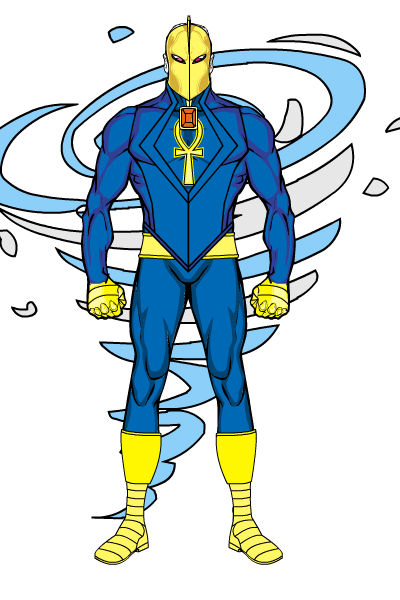

<!--
type: player-character
created-by:
-->

# Amon-Ra
An archaeologist who discovered several magical relics in the area that was once the border of ancient Mesopotamia and Egypt.  The helmet proved to be a conduit to a higher being who taught Franklin to use the various artifacts he found and how to use true magic.  In return, he must combat the forces of chaos and evil, especially those of a mystic nature.

- [AKA](#AKA)
- [Appearance](#Appearance)
- [Personality](#Personality)
- [Origin](#Origin)
- [Powers](#Powers)
- [Notes](#Notes)
- [Allies](#Allies)
- [Associates](Lawrence%20Alexander%20Williams.md#Associates)
- [Birthplace](#Birthplace)
- [Enemies](#Enemies)
- [Home](#Home)
- [Property](#Property)
- [Memberships](#Memberships)
- [Relations](#Relations)
- [Rivals](#Rivals)
- [Visited](#Visited)
- [Adventures](#Adventures)
- [Character Sheet](#Character%20Sheet)

## AKA:
Franklin Kinsey, Professor Kinsey

## Appearance 
Trait | Description
-- | --
Hair: | Brown
Eyes: | Brown
Height: | 6' 6"
Weight: | 216 lbs
Gender: | Male
Notes: |

## Personality

## Origin
As a grad student in the NYU Archaeology program, Franklin Kinsey joined in an expedition to Egypt in 1935 to examine a newly uncovered site on the border of what was once ancient Egypt and Mesopotamia. Other groups from other countries (Britain, France, Germany, Canada, etc) were also at the site assisting with the dig. Of course, unknown to everyone else at the time, the German delegation was actually there on the hunt for ancient mystical relics.

While working the dig site, Franklin met and became friends with Marie Delaunay, a French student with an expertise in Egyptian hieroglyphics. As the year went on, the pair became closer, friendship growing into something more. By the end of the year, the pair were married and enjoyed a lovely honeymoon touring other sites in the Middle East before returning to the dig site.

Upon their return, they learned that an ancient temple dedicated to Thoth, the Egyptian god of Knowledge and Wisdom, had been uncovered. One unusual aspect was that the temple also contained Akkadian writing dedicating the temple to Nabu. This suggested the site was not just sacred to the Egyptians but also the Mesopotamians and that both may have paid homage there during the same time period, roughly 3 to 4 thousand years ago. Within the temple was a sealed box with many cryptic warnings inscribed upon it. These warnings suggested dire consequences should one unworthy open the box. The box was flagged for cataloging and transport to a university where it could be opened safely and properly examined. After photographing the box, Franklin picked it up to carry it up to the waiting cargo truck. However, as soon as it touched it, he fell unconscious, much to the surprise and horror of Marie.

Franklin was rushed to a nearby hospital where they said that he’d fallen into a coma. The doctors could find no physical cause for his state and said that all they could do at this point was wait it out to see if he would regain consciousness on his own. Everyone returned to work as there was nothing they could do, but Marie would come visit each night.

While in his coma, Franklin dreamed. He dreamed he was visited by the ancient god Nabu/Thoth/ Hermes/Odin, for it claimed that it was the embodiment of Wisdom and all those gods were aspects of it. It told him that a new champion was needed as it foresaw a great threat coming. It told him he was selected as ancient magic ran in his blood, whether he knew it or not. For days Franklin was trapped in this comatose state, arguing his fate with this “god”, though he had no sense of the passing time. Eventually, however, he awoke. He wasn’t certain if it was all just a fevered dream or if this god had given up its hold on him.

As he recovered in his hospital room, his doctor informed him of a tragic event. It turned out the Germans were Nazi agents who were really there to steal the ancient artifacts that had been found. Everyone at the site was killed when they stole the treasures and fled back to Germany.

Franklin was distraught and after being discharged from the hospital, he found that he could not return to the dig site as it was still being investigated. He learned that Marie’s body had been returned to her family in France and so that was where he would go next. As he journeyed over the next several days, he again saw the God of Wisdom in his dreams. Every night it would appear to him, demanding that he give in to his destiny to be its champion. It promised that as a champion he would have the power and the knowledge he would need to avenge his wife and unborn child. Marie had never told him she was pregnant.

When he reached France, her family welcomed and commiserated with him. They told him that the autopsy had found that Marie was several weeks pregnant when she’d been murdered, confirming what Franklin had learned from his “dreams”. That night, he agreed to become the god’s champion in promise of being able to get his revenge.

Over the next two years Franklin learned the science of magic as was led to several locations where artifacts that had been touched by the god’s power could be found. The first he was led to was the chest stolen by the Nazis who’d killed his wife. While not all of the perpetrators were present (the woman who lead them, known by the code name ‘Die Hexe’ was elsewhere), he killed all that he found and recovered the chest.  The Nazis had been attempting to open it but were unable to do so.  At Franklin's touch, the chest opened easily and within he found a helmet. With the helmet, his connection to the god was strengthened and he could not speak with his patron while awake rather than only through dreams. He was similarly lead to the resting places of the other artifacts he wields as Amon-Ra.

## Powers
- Several spells (Blessing of Health*, Eyes of the Owl, Judgement Gaze, Moon Paths*, Mystic Vision, Shield of the Winds*, Warning Signs, Weaken Chaos)
- Staff of the Sun (Concealing Mirage, Heat Image, Sunburst*, Sun Beam*, Sun Flare*, Sun Ray*, Sun's Warmth)
- Other Magical Artifacts (Amulet of Shielding, Cape of the Winds*, Helm of the Moon)
- Team Radio

 * Known to the general public

## Notes

### Allies
- [Federal Bureau of Investigation]
- [The God of Wisdom]
- [Guardians of Freedom]

### Associates
- [Chester Dupé] 
- [Mark Dupé] 
- [Click-Click-Hoot]
- [Burt 'Barnstormer' Barlow] 
- [Lucy LaMonte] 
- [Brian Loganach] 
- [Det. Beaumont] 
- [Officer Layne] 
- [Special Agent Lawrence Alexander Williams] 
- [Officer Fitz] 
- [Officer Smitty]

### Birthplace
[New York City]

### Enemies
- [Martians]
- [Doc Macabre]
- the [Elemental Androids]
- the [Axis Legion]
- the [Cult of the Naga]
- the [Serpent King]
- the [Fascist Society of America]
- the [SuperMercs]
- [Atlanteans]
- [Colletti Mob]
- [Dr. Johannas Wagner]
- [Valusi]
- [Fire Hawk]
- [Black Fin]
- [Steel Shark]
- [Die Hexe]
- [Der Rind]
- the [Knight of Crows]

### Home
An abandoned church in [Queens, NY].

### Property
- the sarcophagus of the [Knight of Crows]
- an [Abandoned Church]

### Memberships
- [Vanguard](/organizations/Vanguard.md)
- [New York University] (employee)

### Relations
- [Marie Delaunay](/npcs/Marie_Delaunay.md) (wife, deceased)

### Rivals
- [Zoltan the Magnificent] (friendly)
- [Die Hexe]
- the [Knight of Crows]

### Visited

## Adventures
Issue 01 - Invasion (War of the Worlds Part 1)

## Character Sheet
[Character Sheet](https://legends-of-the-golden-age.github.io/LotGA/pdf/Amon-Ra.pdf)

<!-- GM Notes
Things in here don't show up in normal viewing mode.
-->