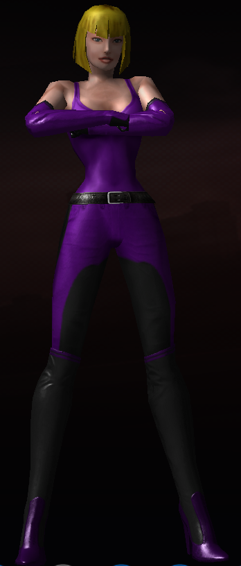

# Diamondback
<!--
type: player-character
created-by:
-->

Raised in the lap of luxury, Alessandra Antonova was not satisfied simply living off the money her family earned in mining and industry.  Instead, she focused herself on raising money to help others.  An accident involving a unique crystal found in one her family's mines caused her to gain incredible strength and durability.  For her, it was a natural transition to use her new-found powers to protect the innocent and down-trodden just as she uses her wealth to help the needy and less-fortunate.  She only wishes her sister, Lilah, was more willing to see how much good their powers can do for the world.

[Character Sheet](https://legends-of-the-golden-age.github.io/LotGA/pdf/Diamondback.pdf)

- [AKA](#AKA)
- [Appearance](#Appearance)
- [Personality](#Personality)
- [Origin](#Origin)
- [Powers](#Powers)
- [Notes](#Notes)
- [Allies](#Allies)
- [Associates](../npcs/friends_and_allies/fbi/Lawrence_Alexander_Williams.md#Associates)
- [Birthplace](#Birthplace)
- [Enemies](#Enemies)
- [Home](#Home)
- [Property](#Property)
- [Memberships](#Memberships)
- [Relations](#Relations)
- [Rivals](#Rivals)
- [Visited](#Visited)
- [Adventures](#Adventures)

## AKA:

Alessandra Antonova

## Appearance 
Trait | Description
-- | --
Hair: | Blonde
Eyes: | Green
Height: | 5' 7"
Weight: | 126 lbs
Gender: | Female
Born: | 1915
Notes: |

## Personality

Charming, outgoing, and socially graceful, Alessandra is everyone's sweetheart. She loves the social interaction of talking to business partners and attending charity balls or socials almost as much as she loves children and gorgeous jewelry. She's accustomed to high society and so can be an unintentional snob at times, but makes up for it with generosity, empathy, and a genuine desire to help others. She loves her family dearly, especially her little brother, Vic.

## Origin

**The Antonova Family**
[Dominic_Antonova](../npcs/family/Dominic_Antonova.md) is the heir to [Antonova Industrial](/organizations/Antonova_Corporation.md), a [New York](/locations/New_York_State/New_York_City/New_York_City.md) company built by his father to supply metals and minerals for industrial purposes. He married [Lydia Williamson](../npcs/family/Lydia_Antonova.md), the daughter of a respected jeweler, in 1912 and they had their first daughter, Lilly, in 1913. Soon after that, news of war in Europe started to draw the nation's attention. Hopeful that the United States would remain neutral and stay out of the war, Dominic and Lydia continued to build their business and Alessandra joined the family in 1915. Dominic was drafted for the war in 1917 and left Lydia w/ their two young daughters, but returned safely in 1919. The third Antonova child, [Victor](../npcs/family/Victor_Antonova.md), was born in 1923. After his father's death in 1930, Dominic inherited full ctrl of Antonova Industrial. The Antonovas combined their families' lines of business and Antonova Industrial became the Antonova Corporation, a supplier of both industrial metals and materials as well as precious stones for jewelers. Now, the Antonovas are wealthy and respected members of society who use their company to engage in philanthropy and pioneer new uses for minerals and metals.

**The Arizona Crystal**
In 1937, a large and mysterious crystal was discovered in an Antonova Corporation copper mine in Arizona. The crystal is similar to a white diamond in appearance, but had a different structure that didn't match any other known material. Antonova Corporation scientists were also puzzled by the fact that the crystal came out of the earth looking professionally cut. The crystal also seemed to have an odd "glow" to it in the light rather than the typical sparkle of a diamond. The [Arizona Crystal](/items/Arizona_Crystal.md) was ultimately determined not to be useful for any practical purpose, but given its beauty and uniqueness, the Antonovas decided to auction it off for charity.

**The Origin Incident**
In early 1938, the Antonovas hosted a charity gala to auction off a number of precious stones and pieces of jewelry, the most highly publicized of which was the Arizona Crystal. During the party prior to the auction, the crystal was on display in the main ballroom in the Antonovas' home. Alessandra was (of course) delighted to spend time in the thick of the party, talking, dancing, and making sure guests were happy and willing to spend lots of money in the auction. Her sister, Lilly, less fond of social events, preferred to stay upstairs in her study researching the other crystals found at the same time as the Arizona Diamond. The party was in full swing when the crystals in Lilly's study began reacting strangely.  Before she could figure out what was happening, they and the Arizona Crystal exploded. The shockwave caused the Arizona Crystal and its display case to shatter and Alessandra caught the shrapnel full force to her back. Several guests at the party were injured, but nobody was killed. The worst of the injuries were Lilly and Alessandra, and they were rushed to receive emergency medical treatment. The doctors were shocked to find that, rather than destroying muscle and bone, the shattered pieces of crystal seemed to have fused themselves seamlessly into Alessandra's back. She was treated for bruising and a concussion from the force of the blast, but the doctors are still unsure how to remove the crystal or if it can even be done at all.

## Powers
- Crysatal Transformation*
- Earthquake Stomp*
- Extreme Density*
- Inhuman Leaps*
- Superhuman Durability*
- Superhuman Strength*
- Team Radio*
- Thunder Clap*
- Wrap in Object*

 * Known to the general public

## Notes
Fluency: Italian, French

### Allies
- [Amon-Ra](player_characters/Amon-Ra.md)
- [Double-Time](player_characters/Double_Time.md)
- [Faceless](player_characters/Faceless.md)
- [Professor Polar](player_characters/Professor_Polar.md)
- [Shard](player_characters/Shard.md)
- [Tarraingteacht](../npcs/friends_and_allies/Tarraingteacht.md)
- [Zoltan](Zoltan.md)

### Associates
- Arthur Howell
- Birog
- Brian Loganach
- Burt 'Barnstormer' Barlow
- Chester Dupé
- Click-Click-Hoot
- Cpt. Brian Laganach
- Defenders of Justice
- Det. Beaumont
- Dr. Leanne Brzezicki
- Federal Bureau of Investigation
- Guardians of Freedom
- Joshaua
- Ka-Pow!
- Knights of Albion
- Leo Lawrence
- Liberty Squad
- Louis Best
- Lt. Liberty
- Lucy LaMonte
- Mark Dupé
- Officer Fitz
- Officer Layne
- Officer Smitty
- Royal Canadian Mounted Police
- [Special Agent Lawrence Alexander Williams](../npcs/friends_and_allies/fbi/Lawrence_Alexander_Williams.md)
- the God of Storms
- Thomas 'Thunderhead' Russ
- U.S. Military

### Birthplace
[New York, NY](/locations/New_York_State/New_York_City/New_York_City.md)

### Enemies
- Atlanteans
- Black Fin
- Colletti Mob
- Der Rind
- Die Hexe
- Doc Macabre
- Dr. Johannas Wagner
- Fire Hawk
- Martians
- Nazis
- Schattenkrieger
- Steel Shark
- the Axis Legion
- the Cult of the Naga
- the Elemental Androids
- the Fascist Society of America
- the Knight of Crows
- the Serpent King
- the SuperMercs
- Tilingkoot
- Valusi

### Home
[Antonova Estate](/locations/New_York_State/New_York_City/Staten_Island/Antonova_Estate.md)

### Property
- Several [Antonova Corporation](/organizations/Antonova_Corporation.md) holdings.
- [Antonova Estate](/locations/New_York_State/New_York_City/Staten_Island/Antonova_Estate.md)
- Vanguard Base

### Memberships
- Antonova Superhuman Tracking and Research (founder)
- [Vanguard](/organizations/Vanguard.md)
- [Antonova Corporation](/organizations/Antonova_Corporation.md) (CEO)

### Relations
- Shard (sister)
- [Dominic Antonova](../npcs/family/Dominic_Antonova.md) (father)
- [Lydia Antonova](../npcs/family/Lydia_Antonova.md) (mother)
- [Victor Antonova](../npcs/family/Victor_Antonova.md) (brother)

### Rivals
- Howard 'Hercules' Humphrey (oddly flirtatious)

### Visited
- [Antonova Estate](/locations/New_York_State/New_York_City/Staten_Island/Antonova_Estate.md)
- Grover's Mill, NJ
- New Brunswick, NJ
- FBI Headquarters, NY
- Martian Base
- Virginia

## Adventures
- [Issue 001 -- Invasion (War of the Worlds Part 1)](sessions/Issue-001.md)
- [Issue 002 -- Showdown in Sandy Hills (War of the Worlds Part 2)](sessions/Issue-002.md)
- [Issue 003 -- Battle of New Brunswick (War of the Worlds Part 3)](sessions/Issue-003.md)

<!-- GM Notes
Things in here don't show up in normal viewing mode.
-->