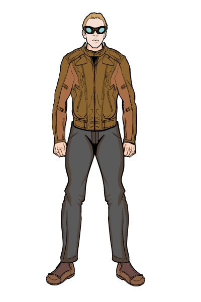

<!--
type: player-character
created-by:
-->
# Double-Time!

As a young lab assistant, Ben, was caught in a lab accident during a strange experiment.  Afterward, he found himself possessed of phenomenal speed.  Able to outrace cars and trains, Ben knows he must use his powers for good even if he's not always clear on how.  Steadfast if a little inexperienced, he views his powers as a great gift and plans to make the best use of them that he can.

- [AKA](#AKA)
- [Appearance](#Appearance)
- [Personality](#Personality)
- [Origin](#Origin)
- [Powers](#Powers)
- [Notes](#Notes)
- [Allies](#Allies)
- [Associates](Lawrence%20Alexander%20Williams.md#Associates)
- [Birthplace](#Birthplace)
- [Enemies](#Enemies)
- [Home](#Home)
- [Property](#Property)
- [Memberships](#Memberships)
- [Relations](#Relations)
- [Rivals](#Rivals)
- [Visited](#Visited)
- [Adventures](#Adventures)
- [Character Sheet](#Character%20Sheet)

## AKA:
Ben Walker

## Appearance 
Trait | Description
-- | --
Hair: | Brown
Eyes: | Brown
Height: | 6' 7"
Weight: | 142 lbs
Gender: | Male
Born: | 1910
Notes: | Ben is tall with brown eyes and sandy-brown hair. Due to his hyper metabolism, he struggles to keep his weight up (he has a BMI of 16 – undernourished) despite eating almost constantly. As DoubleTime! he wears a tight-fitting green-and brown costume that provides some protection against attacks, plus brown gloves and a black mask. As Ben he favors blue jeans and grey t-shirts.

## Personality
Originally Ben was a naïve and happy-go-lucky person, determined to use his powers to further the American Way of life. This once led him to (completely innocently) approach Alessandra Antonova and say, “Quick, I need a girl! Preferably a pretty one!” Since waking from a second Atlantean-caused coma, he has become obsessed with using Science! (hypothesis – experiment – results – conclusion) to approach every situation; as a result he tends to form a hypothesis or use someone else’s hypothesis as a basis to determine a suitable test in every situation. He has a definite bias for action. Ben is happiest when he is hel-PING! (long story).

## Origin
“Ben.” 

“Yes, Dr. Reeds?!” 

“I’m attending a scientific conference this evening, and I need you to monitor my latest experiment. Keep the containment temperature in the green range marked on the thermometer. If it gets too low, open this valve more to provide more coolant flow, if it gets too high, close the valve more. Under no circumstance allow it to get up into the red zone.” 

Ben listened raptly. An orphan, he had been fostered by Dr. Reeds and was eventually allowed to become a lab assistant to the eminent scientist. Now at age 18 he almost worshiped the man. And tonight he was entrusted with monitoring an experiment for the first time!

Ben followed his instructions diligently for several hours. He heard a sharp -crack- from the door behind him just as he was about to open the valve to lower containment temperature. He turned… a bolt of… -something- hit him in the torso and another sped past him to hit the containment vessel. In pain, he saw a shadowed figure at the door… was that the glint of some type of insignia on the left shoulder? No time to think about that; he fell to his hands and knees as he turned back to the experiment… temperature was shooting up to the red zone… he had to follow instructions and open the valve… he could not let Dr. Reeds down… but it felt like he was swimming in mud… he reached out a trembling hand as temperature went into the red. The experiment exploded. As Ben lost consciousness his last thought was, “I wasn’t fast enough”.

When Ben woke from the coma, everything around him seemed to have slowed down. He eventually learned that the world was normal; HE had sped up. Well then, he would use his newfound powers for America! And also be the best lab assistant in the world to atone for his great failure. He still doesn’t know what group was behind the attack on Dr. Reed’s experiment.

## Powers
Super Speed*, Running Up Walls and Over Water*, Compressed-Air Punch*, Throwing Mud*, Punching Groups*, Quick Healing

 * Known to the general public

## Notes

### Allies
- Det. Beaumont
- Dr. Leanne Brzezicki
- [Dr. Reginald Reeds](/npcs/Reginald_Reeds.md) (employer & foster father)
- Federal Bureau of Investigation
- Guardians of Freedom
- Knights of Albion
- Officer Layne
- the God of Storms

### Associates
- Burt 'Barnstormer' Barlow
- Chester Dupe
- Click-Click-Hoot
- Cpt. Brian Laganach
- Lucy LaMonte
- Mark Dupe
- Officer Fitz
- Officer Smitty

### Birthplace
[New_York_City](../locations/New_York_City.md)

### Enemies
- Martians
- Doc Macabre
- the Elemental Androids
- the Axis Legion
- the Cult of the Naga
- the Serpent King
- the SuperMercs
- Atlanteans
- Nazis
- Colletti Mob
- Dr. Johannas Wagner
- Valusi
- Fire Hawk
- Black Fin
- Steel Shark
- Die Hexe
- Der Rind
- the Knight of Crows

### Home
[New York City](../locations/New_York_City.md)

### Property

### Memberships
[Vanguard](../organizations/Vanguard.md)

### Relations
- [Reginald Reeds](../npcs/Reginald_Reeds.md) (foster father)

### Rivals
- Charles 'Speedy' Siegal

### Visited

## Adventures
Issue 01 - Invasion (War of the Worlds Part 1)

## Character Sheet
[Character Sheet](https://legends-of-the-golden-age.github.io/LotGA/pdf/Double-Time.pdf)

<!-- GM Notes
Things in here don't show up in normal viewing mode.
-->