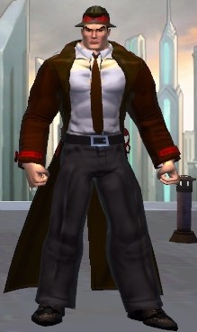

<!--
type: player-character
created-by:
-->
# Faceless

Michael was an orphan raised by a government agent.  When he was old enough, he chose to work for the FBI.  Not long after starting his career, he discovered that he had the ability to change his shape to match anyone he sees.  A solid patriot, Michael has dedicated himself to using his powers to root the out enemies of the U.S. 

- [AKA](#AKA)
- [Appearance](#Appearance)
- [Personality](#Personality)
- [Origin](#Origin)
- [Powers](#Powers)
- [Notes](#Notes)
- [Allies](#Allies)
- [Associates](#Associates)
- [Birthplace](#Birthplace)
- [Enemies](#Enemies)
- [Home](#Home)
- [Property](#Property)
- [Memberships](#Memberships)
- [Relations](#Relations)
- [Rivals](#Rivals)
- [Visited](#Visited)
- [Adventures](#Adventures)
- [Character Sheet](#Character%20Sheet)

## AKA:
Michael Norman Smith

## Appearance 
Trait | Description
-- | --
Hair: | Brown
Eyes: | Brown
Height: | 5' 10"
Weight: | 183 lbs
Gender: | Male(?)
Born: | June 3, 1913
Notes: | Adopted in 1926.

## Personality

## Origin
For the first 12 years of his life, Michael grew up in an orphanage in Plattsburg, NY.  He frequently ran away from the orphanage, only to return when things got difficult.  When he was around the age of 13, an FBI agent, Lawrence Alexander Williams, was looking into the orphanage due to some mob money ties. He learned Michael's ability to practically disappear for days and then return, all unseen.  He also learned that Michael had been left at a local hospital by a tall man with ashen skin, intense grey eyes and an odd accent; who claimed he had found the baby in the woods. Agent Lawrence decided to adopt Michael and begin to train him.

It wasn't long before Michael's shape-shifting abilities were discovered.  In order to protect the child, Agent Williams used his contacts to create a false birth certificate for Michael, showing him as having been born at Fordham Hospital in the Bronx, on June 3rd, 1913.

Michael quickly saw Lawrence as a father and a mentor and, at the age of 16, Michael joined the FBI as an novice agent. Michael spends a lot of his free time trying to figure out who his real parents are, wondering if they are like him or if that was the reason they gave him away. While on the job he is a true Patriot who loves his country and will do anything for it.

## Powers
- Can Flow Through Cracks
- Highly Damage Resistant*
- Multi-Limbed Strikes*
- Quick Healing*
- Shape Shifting
- 'Springy' Legs*
- Stretching*
- Weapon Arms*

 * Known to the general public

## Notes

### Allies
- [Amon-Ra](Amon-Ra.md)
- [Diamondback](Diamondback.md)
- [Double-Time](Double_Time.md)
- [FBI](/organizations/Government/FBI.md)
- [Professor Polar](player_characters/Professor_Polar.md)
- [Shard](player_characters/Shard.md)
- [Special Agent Lawrence Alexander Williams](/npcs/Lawrence_Alexander_Williams.md)

### Associates
- Burt 'Barnstormer' Barlow
- Chester Dupe
- Click-Click-Hoot
- Cpt Brian Loganach
- Defenders of Justice
- Det. Beaumont
- Dr. Leanne Brzezicki
- Guardians of Freedom
- Knights of Albion
- Liberty Squad
- Lucy LaMonte
- Mark Dupe
- Officer Fritz
- Officer Layne
- Officer Smitty
- the God of Storms

### Birthplace
[The Bronx](/locations/New_York_State/New_York_City/The_Bronx/The_Bronx_NY.md) (officially)

### Enemies
- Atlanteans
- Black Fin
- Colletti Mob
- Der Rind
- Die Hexe
- Doc Macabre
- Dr. Johannas Wagner
- Fire Hawk
- Martians
- Nazis
- Schattenkrieger
- Steel Shark
- the Axis Legion
- the Cult of the Naga
- the Elemental Androids
- the Fascist Society of America
- the Knight of Crows
- the Serpent King
- the SuperMercs
- Tilingkoot
- Valusi

### Home
[New York City](/locations/New_York_State/New_York_City/New_York_City.md)

### Property

### Memberships
- [Vanguard](/organizations/Vanguard.md)
- [FBI](/organizations/Government/FBI.md)

### Relations
Special Agent [Lawrence_Alexander_Williams](/npcs/Lawrence_Alexander_Williams.md) (adoptive father)

### Rivals

### Visited

## Adventures
Issue 01 - Invasion (War of the Worlds Part 1)

## Character Sheet
[Character Sheet](https://legends-of-the-golden-age.github.io/LotGA/pdf/Faceless.pdf)

<!-- GM Notes
Things in here don't show up in normal viewing mode.
-->