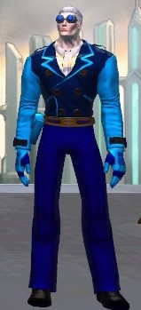

<!--
type: player-character
created-by:
-->
# Professor Polar

A super-scientist with the ability to project "cold energy" from his body.  He has invented a number of gadgets to help control is power as well as provide himself with a means of defense.  He seeks to advance the world's knowledge and protect the world from those who would abuse science.

[Character Sheet](https://legends-of-the-golden-age.github.io/LotGA/pdf/Professor_Polar.pdf)

- [AKA](#AKA)
- [Appearance](#Appearance)
- [Personality](#Personality)
- [Origin](#Origin)
- [Powers](#Powers)
- [Notes](#Notes)
- [Allies](#Allies)
- [Associates](../npcs/friends_and_allies/fbi/Lawrence_Alexander_Williams.md#Associates)
- [Birthplace](#Birthplace)
- [Enemies](#Enemies)
- [Home](#Home)
- [Property](#Property)
- [Memberships](#Memberships)
- [Relations](#Relations)
- [Rivals](#Rivals)
- [Visited](#Visited)
- [Adventures](#Adventures)

## AKA:
Professor Sean Gorman

## Appearance 
Trait | Description
-- | --
Hair: | White / Brown
Eyes: | White / Green
Height: | 5' 2"
Weight: | 119lbs
Gender: | male
Born: |
Notes: | Items before the '/' are while his powers are active.

## Personality
Sean approaches the world as one big and wonderful puzzle to be understood for what it is. After that you work on changing it to be better. He tends to be calm and logical, even when motivated by powerful emotions. He still feels the loss of his father and is motivated to prevent that suffering in others.

Sean believes that the responsible use of technology and advancement of science will create a safer and better world. He is working for these ends in his research and has also decided to become Professor Polar to control those forces which are irresponsible with them.

## Origin
**Family**
Mother came to US as a teenager with Grandmother; bringing the old stories and language with her.
Father is from working class family that has been in US for generations.
Grandmother, Mother, two older sisters, and one older brother are still alive.
Father died when he was ten (1922) in an accident at the steel foundry he worked at.

**Personal**
Sean's has always been very smart. This led to a lot of time spent alone as a child. His father always supported his “book learnin” and his death is still a drive for Sean. He sees the accident as something that could have been avoided if the owner of the foundry had cared more about his people than his money and developed better safety equipment and practices.

Maimeó (grandmother) helped his mother take care of the children and told stories of ancestors who were druids and people of great skill and influence; the stories always included the moral that this brought an obligation to help others with these gifts.

When he attended college his lower class upbringing and age (15) as well as his intelligence did him no favors in the friend department. He learned to mimic the speech patterns of the people around him and to blend in with the more affluent members of society that attended the university. He had a PhD in Physics by the age of 20 and has published multiple papers and patents.

Sean is attached to his family, but is still only close with his mother and grandmother.

When working on his first cold engine, something went horribly wrong and the engine produced a surge of energy that flooded the room. When Sean woke up, all of the water in the room was frozen and his body had been changed dramatically. It took several days to learn to dampen his personal cold field. He then developed the focusing tools he uses now as Professor Polar. He still can not figure out what went wrong as all further engine prototypes have not shown any signs of surging, they just fail after a short time.

## Powers
- Bag-o-Gadgets
- Bone Chiller
- Cold Aura
- Cold Grenade
- Cold Gun (Cold Focuser)\*
- Cold Reactive Coat (armor)
- Cone of Cold (Focused Aura)\*
- Fire Suppression\*
- Freeze Water\*
- Freezing Touch (Intense Touch)\*
- Grapple Gun\*
- Sleep 1 hour / day

 * Known to the general public

## Notes
- Fluent in Gaelic as well as English.
- Has one of Doc Macabre's journals.

### Allies
- [Amon-Ra](player_characters/Amon-Ra.md)
- [Diamondback](player_characters/Diamondback.md)
- [Double Time!](player_characters/Double_Time.md)
- [Faceless](player_characters/Faceless.md)
- [Shard](player_characters/Shard.md)
- [Tarraingteacht](../npcs/friends_and_allies/Tarraingteacht.md)
- [Zoltan](Zoltan.md)

### Associates
- Birog
- Brian Loganach
- Burt 'Barnstormer' Barlow
- Chester Dupé
- Click-Click-Hoot
- Cpt. Brian Laganach
- Defenders of Justice
- Det. Beaumont
- Dr. Leanne Brzezicki
- [FBI](../organizations/US_Government/FBI.md)
- Guardians of Freedom
- Joshaua
- Ka-Pow!
- Knights of Albion
- Leo Lawrence
- Liberty Squad
- Lt. Liberty
- Lucy LaMonte
- Mark Dupé
- Officer Fitz
- Officer Layne
- Officer Smitty
- [Special Agent Lawrence Alexander Williams](../npcs/friends_and_allies/fbi/Lawrence_Alexander_Williams.md)
- the God of Storms
- Thomas 'Thunderhead' Russ
- U.S. Military

### Birthplace

### Enemies
- Atlanteans
- Black Fin
- Colletti Mob
- Der Rind
- Die Hexe
- Doc Macabre
- Dr. Johannas Wagner
- Fire Hawk
- Martians
- Nazis
- Schattenkrieger
- Steel Shark
- the Axis Legion
- the Cult of the Naga
- the Elemental Androids
- the Fascist Society of America
- the Knight of Crows
- the Serpent King
- the SuperMercs
- Tilingkoot
- Valusi

### Home
[New York City](/locations/New_York_State/New_York_City/New_York_City.md)

### Property
- Lab in [New York City](/locations/New_York_State/New_York_City/New_York_City.md)

### Memberships
- [New York University](/organizations/New_York_University.md) (professor)
- [Vanguard](/organizations/Vanguard.md)

### Relations
Grandmother, Mother, two older sisters, and one older brother

### Rivals
- Sako Norogumi
- the Ghost

### Visited

## Adventures
- [Issue 001 -- Invasion (War of the Worlds Part 1)](sessions/Issue-001.md)
- [Issue 002 -- Showdown in Sandy Hills (War of the Worlds Part 2)](sessions/Issue-002.md)
- [Issue 003 -- Battle of New Brunswick (War of the Worlds Part 3)](sessions/Issue-003.md)

<!-- GM Notes
Things in here don't show up in normal viewing mode.
-->