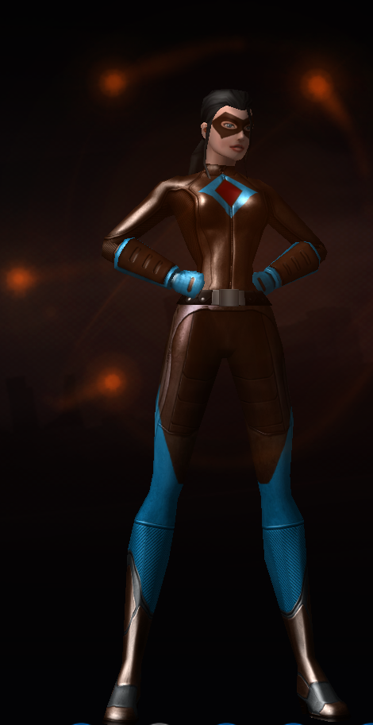

<!--
type: player-character
created-by:
-->
# Shard

Lilah, born into the affluent Antonova family, was not content to simply be one of the idle rich.  While her sister focused on social activities, Lilah focused on science.  After an accident gave them both supernatural powers, they decided to use those powers for the protection of others.

[Character Sheet](https://legends-of-the-golden-age.github.io/LotGA/pdf/Shard.pdf)

- [AKA](#AKA)
- [Appearance](#Appearance)
- [Personality](#Personality)
- [Origin](#Origin)
- [Powers](#Powers)
- [Notes](#Notes)
- [Allies](#Allies)
- [Associates](../npcs/friends_and_allies/fbi/Lawrence_Alexander_Williams.md#Associates)
- [Birthplace](#Birthplace)
- [Enemies](#Enemies)
- [Home](#Home)
- [Property](#Property)
- [Memberships](#Memberships)
- [Relations](#Relations)
- [Rivals](#Rivals)
- [Visited](#Visited)
- [Adventures](#Adventures)

## AKA:
Lilah Antonova

## Appearance 
Trait | Description
-- | --
Hair: | black
Eyes: | green
Height: | 5' 9"
Weight: | 128 lbs
Gender: | female
Born: | 1913
Notes: |

## Personality
Impatient, arrogant, insular. Worried about family business and family situation. Fiercely protective and loyal. Tends to be a bit class-sensitive.

## Origin
**The Antonova Family**
[Dominic_Antonova](../npcs/family/Dominic_Antonova.md) is the heir to [Antonova Industrial](/organizations/Antonova_Corporation.md), a [New York](/locations/New_York_State/New_York_City/New_York_City.md) company built by his father to supply metals and minerals for industrial purposes. He married [Lydia Williamson](../npcs/family/Lydia_Antonova.md), the daughter of a respected jeweler, in 1912 and they had their first daughter, Lilly, in 1913. Soon after that, news of war in Europe started to draw the nation's attention. Hopeful that the United States would remain neutral and stay out of the war, Dominic and Lydia continued to build their business and Alessandra joined the family in 1915. Dominic was drafted for the war in 1917 and left Lydia w/ their two young daughters, but returned safely in 1919. The third Antonova child, [Victor](../npcs/family/Victor_Antonova.md), was born in 1923. After his father's death in 1930, Dominic inherited full ctrl of Antonova Industrial. The Antonovas combined their families' lines of business and Antonova Industrial became the Antonova Corporation, a supplier of both industrial metals and materials as well as precious stones for jewelers. Now, the Antonovas are wealthy and respected members of society who use their company to engage in philanthropy and pioneer new uses for minerals and metals.

**The Arizona Crystal**
In 1937, a large and mysterious crystal was discovered in an Antonova Corporation copper mine in Arizona. The crystal is similar to a white diamond in appearance, but had a different structure that didn't match any other known material. Antonova Corporation scientists were also puzzled by the fact that the crystal came out of the earth looking professionally cut. The crystal also seemed to have an odd "glow" to it in the light rather than the typical sparkle of a diamond. The [Arizona Crystal](/items/Arizona_Crystal.md) was ultimately determined not to be useful for any practical purpose, but given its beauty and uniqueness, the Antonovas decided to auction it off for charity.

**The Origin Incident**
In early 1938, the Antonovas hosted a charity gala to auction off a number of precious stones and pieces of jewelry, the most highly publicized of which was the Arizona Crystal. During the party prior to the auction, the crystal was on display in the main ballroom in the Antonovas' home. Lilah's sister, Alessandra, was (of course) delighted to spend time in the thick of the party, talking, dancing, and making sure guests were happy and willing to spend lots of money in the auction.  Lilah, being less fond of social events. preferred to stay upstairs in her study with her chemistry research. The party was in full swing when the crystals she was studying (those found along side the Arizona Crystal) began to glow and vibrate.  Unaware of what this meant, Lilah was fascinated to observe this strange behavior, wondering what was triggering it.   Unfortunately, whatever reaction the crystals were having grew in intensity until they exploded. The shockwave caused the Arizona Crystal and its display case to shatter and Alessandra caught the shrapnel full force to her back. Later investigation suggested some sort of harmonic resonance was created between the Arizona Crystal on display and the crystals Lilah was examining upstairs.  The explosion shattered the intervening floor and as the all the crystals (and Lilah) fell closer, the Arizona Crystal exploded with amazingly limited violence mainly centered on the two sisters as they are just feet away from the center of the explosion.

Several guests at the party were injured, but nobody was killed. The worst of the injuries were Lilah and her sister.  They are rushed to receive emergency medical treatment. The doctors were shocked to find that, Lilah's skin was virtually shredded over her entire body.  While some fragments also struck her sister (who was similarly transformed), those that struck Lilah appeared to have disintegrated into a crystalline cloud of  nearly microscopic shards. Those crystal fragments seeped into her blood stream and became a part of her, causing her skin to rapidly seal back up, healing her wounds.  A layer of living crystal had fused itself with the remaining epidermal tissue, forming a whole new, crystal-reinforced, layer skin.

## Powers
- Bullet Resistant\* 
- Crystal Cocoons\*
- Crystal Shards\*
- Crystal Walls\*
- Explosive Shards\*
- Is a Radio, Flight\*
- Nightvision
- Regeneration 

 * Known to the general public

## Notes
- Fluent in French

### Allies
- [Amon-Ra](player_characters/Amon-Ra.md)
- [Diamondback](player_characters/Diamondback.md)
- [Double-Time](player_characters/Double_Time.md)
- [Faceless](player_characters/Faceless.md)
- [Professor Polar](player_characters/Professor_Polar.md)
- [Tarraingteacht](../npcs/friends_and_allies/Tarraingteacht.md)
- [Zoltan](Zoltan.md)

### Associates
- Arthur Howell
- Birog
- Brian Loganach
- Burt 'Barnstormer' Barlow
- Chester Dupé
- Click-Click-Hoot
- Cpt. Brian Laganach
- Defenders of Justice
- Det. Beaumont
- Dr. Alan Kripke
- Dr. Leanne Brzezicki
- [FBI](../organizations/US_Government/FBI.md)
- Guardians of Freedom
- Joshaua
- Ka-Pow!
- Knights of Albion
- Leo Lawrence
- Liberty Squad
- Louis Best
- Lt. Liberty
- Lucy LaMonte
- Mark Dupé
- Officer Fitz
- Officer Layne
- Officer Smitty
- Royal Canadian Mounted Police
- [Special Agent Lawrence Alexander Williams](../npcs/friends_and_allies/fbi/Lawrence_Alexander_Williams.md)
- the God of Storms
- Thomas 'Thunderhead' Russ
- U.S. Military

### Birthplace
[New York City](locations/New_York_State/New_York_City/New_York_City.md)

### Enemies
- Atlanteans
- Black Fin
- Colletti Mob
- Der Rind
- Die Hexe
- Doc Macabre
- Dr. Johannas Wagner
- Fire Hawk
- Martians
- Nazis
- Schattenkrieger
- Steel Shark
- the Axis Legion
- the Cult of the Naga
- the Elemental Androids
- the Fascist Society of America
- the Knight of Crows
- the Serpent King
- the SuperMercs
- Tilingkoot
- Valusi

### Home
- [Antonova Estate](locations/New_York_State/New_York_City/Staten_Island/Antonova_Estate.md)
- [Staten Island](locations/New_York_State/New_York_City/Staten_Island/Staten_Island.md)
- [New York City](locations/New_York_State/New_York_City/New_York_City.md)

### Property
- [Antonova Estate](locations/New_York_State/New_York_City/Staten_Island/Antonova_Estate.md)
- [Personal Laboratory](locations/New_York_State/New_York_City/Staten_Island/Shards_Laboratory.md)

### Memberships
- [Vanguard](organizations/Vanguard.md)
- [Antonova Corporation](organizations/Antonova_Corporation.md)

### Relations
- [Dominic Antonova](../npcs/family/Dominic_Antonova.md) (father)
- [Lydia Antonova](../npcs/family/Lydia_Antonova.md) (mother)
- [Diamondback](player_characters/Diamondback.md) (sister)
- [Victor Antonova](../npcs/family/Victor_Antonova.md) (brother)

### Rivals

### Visited

## Adventures
- [Issue 001 -- Invasion (War of the Worlds Part 1)](sessions/Issue-001.md)
- [Issue 002 -- Showdown in Sandy Hills (War of the Worlds Part 2)](sessions/Issue-002.md)
- [Issue 003 -- Battle of New Brunswick (War of the Worlds Part 3)](sessions/Issue-003.md)

<!-- GM Notes
Things in here don't show up in normal viewing mode.
-->