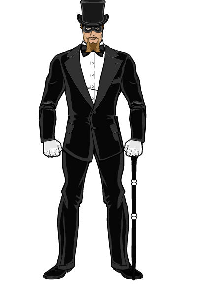

<!--
type: player-character
created-by:
-->
# Zoltan the Magnificent

A stage magician from the old world, he fled Europe after an incident in Nazi Germany just before the invasion of Poland.

[Character Sheet](https://legends-of-the-golden-age.github.io/LotGA/pdf/Zoltan.pdf)

- [AKA](#AKA)
- [Appearance](#Appearance)
- [Personality](#Personality)
- [Origin](#Origin)
- [Powers](#Powers)
- [Notes](#Notes)
- [Allies](#Allies)
- [Associates](../npcs/friends_and_allies/fbi/Lawrence_Alexander_Williams.md#Associates)
- [Birthplace](#Birthplace)
- [Enemies](#Enemies)
- [Home](#Home)
- [Property](#Property)
- [Memberships](#Memberships)
- [Relations](#Relations)
- [Rivals](#Rivals)
- [Visited](#Visited)
- [Adventures](#Adventures)

## AKA:
Morty Rabinowitz, The Great Ozwald, Zindelo Marcovici

## Appearance 
Trait | Description
-- | --
Hair: | Black
Eyes: | Brown
Height: | 5' 11"
Weight: | 179lbs
Gender: |male
Born: | sometime in the 1890s
Notes: | 

Zoltan is 5 foot, 11 inches tall and 180 pounds. Somewhat tall for the time, he is not "stand out" tall and is relatively compact for his height. He has striking brown eyes and jet-black hair. He tends to strike dramatic poses and use a dramatic flair to enhance his appearance as a performer.

## Personality
Zoltan plays up the "Mysterious Eastern Arts" and occult side of his stage act and carries this over into his adventures. Only with his own people (the Roma) does he drop the act. A true performer, he believes that any show that he begins must be completed at almost any cost. He doesn't like bullies in any form and resists organized crime, the Nazis, and any other groups that seek to dominate others by force or subjugation.

## Origin
Zoltan the Magnificent is a stage magician in the 1930's mainly playing [New York City](/locations/New_York_State/New_York_City/New_York_City.md) clubs. He has toured the world in the past, however and tends to pick up major languages from the locales he visits. His secret occult background is due to his Romany (Gypsy) background and some study of the "Eastern Arts". His mystical abilities help him perform his various stage acts, even some very dangerous cage and water trap acts. Born in Serbia, raised in Romania, Zoltan pretends to be of Jewish descent, which he believes will be less objectionable to many compared to his Romany descent, except for the Nazis.

Zoltan the Magnificent came though Germany in the mid-30's while coming from Romania. He had not yet adopted the “Zoltan” guise and was instead going by “The Great Ozwald” but did not hide his Roma ancestry. Nor did he have all of his powers, with many of his shows requiring his sleight of hand and lock picking skills - getting out of chains, handcuffs, and the like.

“The Great Ozwald” was touring Berlin in the summer of 1936, just prior to the [Olympic Games](https://en.wikipedia.org/wiki/1936_Summer_Olympics) that were to be held in August. As a well-paid showman, “The Great Ozwald” had mostly been ignored until now. During the raid of July 16th, he was rounded up with 600-800 other Roma and placed in a camp in the Berlin suburb of [Marzahn](https://en.wikipedia.org/wiki/Marzahn), in an open field between a cemetery and a sewage treatment plant. Prior to being sterilized, “Ozwald” made his escape and managed to get out of Berlin without any of his equipment or assistants. He was barely able to help several other Roma to escape but he never found the fate of the others after they got away and split up to avoid detection. He made his way to France and began working towards moving to the United States, shortly after, working on the “Zoltan” guise.

## Powers
- Bullet Resistance\*
- Conjure Smoke\*
- Counter-Magic
- Entangling Ribbon\*
- Illusions\*
- Invisibility\*
- Mass Mesmerism\*
- Mind Over Matter\* (telekinesis)
- Mind Reading\*
- Mind Scan
- Psychic Blast\*
- Psychic Wall
- Psychic Wards
- Sense Spirits
- Telekinetic Slap\* (aka Psychic Slap)
- Teleportation\*
- Walking on Air\*

 * Known to the general public

## Notes
Fluency: Roma, Romanian, German, Slovak, Hebrew

### Allies
- [Amon-Ra](Amon-Ra.md)
- [Diamondback](Diamondback.md)
- [Double-Time](Double_Time.md)
- [Elan Klempar](../npcs/friends_and_allies/Elan_Klempar.md) (deceased, mentor)
- [Faceless](Faceless.md)
- [Madam Dannica](../npcs/friends_and_allies/Madam_Dannica.md) (paramour, student)
- [Professor Polar](Professor_Polar.md)
- [Shard](Shard.md)
- [Those Who See](/organizations/Those_Who_See.md)

### Associates
- Arthur Howell
- Birog
- Brian Loganach
- Burt 'Barnstormer' Barlow
- Chester Dupé
- Click-Click-Hoot
- Cpt. Brian Laganach
- Defenders of Justice
- Det. Beaumont
- Dr. Leanne Brzezicki
- [FBI](/organizations/US_Government/FBI.md)
- Guardians of Freedom
- Joshaua
- Ka-Pow!
- Knights of Albion
- Leo Lawrence
- Liberty Squad
- Louis Best
- Lt. Liberty
- Lucy LaMonte
- Mark Dupé
- Officer Fitz
- Officer Layne
- Officer Smitty
- Royal Canadian Mounted Police
- [Special Agent Lawrence Alexander Williams](../npcs/friends_and_allies/fbi/Lawrence_Alexander_Williams.md)
- the God of Storms
- Thomas 'Thunderhead' Russ
- [Those Who See](/organizations/Those_Who_See.md)
- U.S. Military

### Birthplace
[Serbia](https://en.wikipedia.org/wiki/Serbia)

### Enemies
- Atlanteans
- Black Fin
- Colletti Mob
- Der Rind
- Die Hexe
- Doc Macabre
- Dr. Johannas Wagner
- Fire Hawk
- Martians
- Nazis
- Schattenkrieger
- Steel Shark
- the Axis Legion
- the Cult of the Naga
- the Elemental Androids
- the Fascist Society of America
- the Knight of Crows
- the Serpent King
- the SuperMercs
- Tilingkoot
- Valusi

### Home
[New York City](/locations/New_York_State/New_York_City/New_York_City.md)

### Property
- [Vanguard Headquarters](/locations/New_York_State/New_York_City/Brooklyn/Vanguard_Headquarters.md)

### Memberships
- [Empire Theater](https://en.wikipedia.org/wiki/Empire_Theatre_(41st_Street)) (former employee)
- [Vanguard](/organizations/Vanguard.md)

### Relations

### Rivals
- [Amon-Ra](Amon-Ra.md) (friendly)

### Visited

## Adventures
- [Issue 001 -- Invasion (War of the Worlds Part 1)](sessions/Issue-001.md)
- [Issue 002 -- Showdown in Sandy Hills (War of the Worlds Part 2)](sessions/Issue-002.md)
- [Issue 003 -- Battle of New Brunswick (War of the Worlds Part 3)](sessions/Issue-003.md)

<!-- GM Notes
Things in here don't show up in normal viewing mode.
-->
